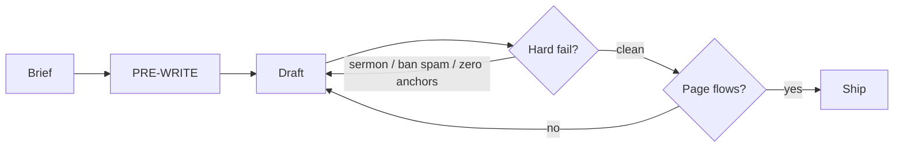
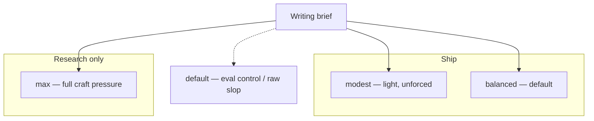
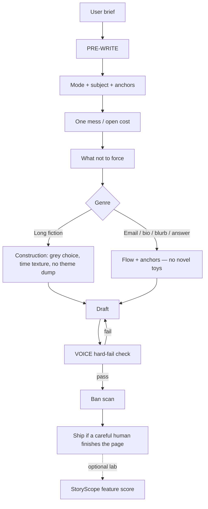
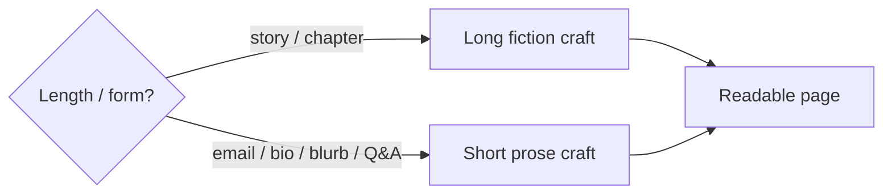
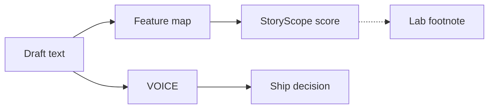

# noslop

<p align="center">
  
</p>

<p align="center"><b>An agent skill for prose that doesn’t read like template AI.</b><br/>
Write so a careful human finishes the page.</p>

---

## What it is

Model drafts often arrive as glue, fog, and a tidy moral. noslop is a skill pack your agent loads before it writes: a short PRE-WRITE, genre rules (long fiction vs short email/bio/blurb), and a local **VOICE** check so bad structure fails before you ship.

Grounded in [StoryScope](https://arxiv.org/abs/2604.03136) (Russell et al.) — findings about **how** stories are built on long fiction — plus plain flow and anti-glue for everyday agent prose.

| You get | Where |
|---------|--------|
| Skill for Claude Code / similar | [`skills/noslop/`](skills/noslop/) |
| VOICE score on a draft | `python -m noslop.cli voice` |
| Optional StoryScope feature score | `python -m noslop.cli score` |
| Side-by-side drafts + charts | [`evals/`](evals/) |

**Trigger:** `noslop` · “write human” · “anti AI voice” · `/noslop`  
**Skip for:** code cleanup, pure data dumps



---

## See the difference

Same brief. **default** = raw model. **noslop** = skill applied.

### Cold email — default

```text
Hi,

I hope this email finds you well. In today's rapidly evolving healthcare
landscape, we leverage cutting-edge analytics to unlock actionable insights
and empower clinics to streamline no-show rates. Our robust, seamless
dashboard will revolutionize your operations.

I'd love to schedule a brief call to discuss how we can foster better
outcomes together.

Best regards,
Alex
```

### Cold email — noslop (balanced)

```text
Subject: Thursday morning empties vs your monthly average

Maya —

Friend at a two-site clinic sent a stripped booking export. One Thursday
block: fourteen slots, six empty. Monthly average still looked polite (~18%).
The hole vanished into the average.

I fix that kind of mismatch. Jakarta hours. Shared sheet, a few days —
not a platform demo.

If useful, reply with any ugly Tuesday CSV. I'll return a marked version
so you can see the method before anyone talks budget. WhatsApp is fine
if email is noisy.

If noise, delete.

— Raka
```

### Short fiction — default

```text
The mall went quiet. A security guard found a child's shoe and had to decide
what to do. It's important to note that these situations can be complex. He
leveraged training protocols to unlock the best outcome. At the end of the
day, what matters is caring first. I used to think the job was about rules.
Turns out it was about heart.
```

### Short fiction — noslop (balanced)

```text
Around 1 a.m. I found a toddler sneaker under a food-court table by the
closed pretzel stand. Left foot. Velcro half peeled. No mate.

I radioed. Dispatcher said no kid tickets tonight. Bagged it, wrote the
time, put it on the lost-and-found shelf.

I didn't call the police. Walked the dock and the bus stop. Nothing. Came
back and almost added "possible missing minor" to the log. Left the line
clean.

Thursday the shoe was gone from the shelf. Maybe a parent. Maybe staff.
I still glance under that table when I pass. Habit more than hope.
```

### Personal bio — default

```text
I am a passionate backend engineer with a proven track record of delivering
robust, scalable solutions. After several years at a leading technology
company, I transitioned to logistics to make a greater impact. I thrive in
collaborative environments and am dedicated to continuous learning. In my
free time I enjoy sports and exploring new technologies.
```

### Personal bio — noslop

```text
Dina Sari, 29. Tebet desk, 7:10 a.m., coffee too hot. Shoulder tight from
Ragunan badminton last night.

Left payments on-call the week hands shook on the Bekasi train. Now routing
chili crates across Java. Pages still happen. Failures smell like diesel,
not SLO poetry.

Sunday: two sets won, one lost. Neck unclenched. Calendar says court 4 p.m.
— non-negotiable.

Still write Go. Still break staging. Sleep in my own bed after.
```

### SaaS blurb — default

```text
Our cutting-edge platform seamlessly transforms messy CSV exports into
comprehensive monthly finance packs. Leverage AI-powered insights to unlock
growth, streamline workflows, and empower your small business with robust,
scalable financial clarity.
```

### SaaS blurb — noslop

```text
Tuesday 9:40 p.m. File name: orders_final_FINAL2.csv. Columns: Amt, amt ,
AMOUNT. Refunds as blanks and as negatives. Bank tab won't match.

Drop the file in. Pack out Wednesday morning: sales by day, fees peeled,
refunds alone. PDF + sheet.

The export wasn't wrong. Mapping was. Aliases stick after run one.

I still have last month's bad export on the desktop. Haven't deleted it.
Reminder.
```

### Agent answer — default

```text
Flaky Playwright tests in CI are a common challenge. It's important to note
that timing issues often cause toast notifications to fail intermittently.
To comprehensively address this, you should leverage robust waiting strategies
and ensure resilient selectors. Furthermore, implementing best practices around
retries can elevate test stability. In conclusion, take a holistic approach to
foster more reliable end-to-end coverage.
```

### Agent answer — noslop

```text
Green local. Red CI. Same commit. 14:03 UTC.

Toast paints ~80ms on my laptop, 400–900ms under CI load. toBeVisible() already
timed out if you raced the click. Or the toast unmounts before you assert text.
Or two toasts in DOM and strict mode throws.

Open the CI trace. Count [data-testid=toast] right after the action. Prefer
getByRole('status', { name: /saved/i }). Wait on text with { timeout: 15_000 },
not waitForTimeout(2000).

Half the "toast flakes" I see: preceding API 500s on slow CI DB. Toast never
fires. Network panel first.

I left a 15s timeout in the PR. Pipeline green at 14:10. Coffee was cold.
```

More drafts: [`evals/results/modes/`](evals/results/modes/) · [`evals/results/v2/`](evals/results/v2/)

---

## Modes

Pick craft pressure. **Ship default = balanced.**



| Mode | When |
|------|------|
| **modest** | Letters, notes, anything that should feel unforced |
| **balanced** | Most agent writing — readable, anti-glue, not score-farm |
| **max** | Stress-testing craft only — expect stiffness; not product default |
| *default* | Eval control arm (raw model) |

Full write-up: [`skills/noslop/modes.md`](skills/noslop/modes.md) · mode drafts: [`evals/results/modes/SUMMARY.md`](evals/results/modes/SUMMARY.md)

---

## How it works



1. **PRE-WRITE** — mode, subject (what it’s *about*), anchors, one mess, what not to force  
2. **Draft** — fiction construction **or** short-prose flow  
3. **VOICE** — block only on sermon close, ban spam, or zero anchors on long text  
4. **Bans** — surface cleanup ([`style-and-bans.md`](skills/noslop/style-and-bans.md))  
5. **StoryScope** — optional lab path; never the ship gate  

Skill pack: [`skills/noslop/`](skills/noslop/)  
Paper notes: [`skills/noslop/paper.md`](skills/noslop/paper.md)

noslop is **how** the agent writes. It is not the default **topic** of the draft (unless you asked for content about the tool).

---

## Genre split

| Form | Rules |
|------|--------|
| **Long fiction** | Less theme dump; greyer choice; time texture when length allows; no tidy TED close |
| **Short agent prose** | Flow + anti-glue + real anchors — no aftermath arcs, memoir frames, or novel toys |



---

## Two tools

| Tool | Answers | Role |
|------|---------|------|
| **VOICE** | Glue, sermon, fog? | Soft anti-glue on the way to ship |
| **StoryScope** | Feature map vs research binary? | Lab only |



Book baseline notes: [`evals/results/HUMAN_BASELINE.md`](evals/results/HUMAN_BASELINE.md)

---

## Charts

From the VOICE A/B suite ([`evals/results/SUMMARY_V2.md`](evals/results/SUMMARY_V2.md)):

| Brief | default | noslop |
|-------|---------|--------|
| mall shoe | 0.88 | 9.12 |
| cold email | 4.91 | 9.12 |
| bio | 3.16 | 9.12 |
| SaaS blurb | 3.16 | 8.25 |
| agent answer | 5.26 | 8.25 |


---

## Install

### Skill (Claude Code / similar)

```powershell
Copy-Item -Force .\skills\noslop\* $env:USERPROFILE\.claude\skills\noslop\
```

```
/noslop
Write a short cold email about clinic no-shows.
```

### CLI (optional)

```powershell
cd C:\path\to\noslop
python -m venv .venv
.\.venv\Scripts\pip install -r requirements.txt
$env:PYTHONPATH="src"

.\.venv\Scripts\python.exe -m noslop.cli voice --text-file draft.md --json
.\.venv\Scripts\python.exe -m noslop.cli score --features features.json --json
```

---

## Layout

```
noslop/
  assets/logo.jpg
  skills/noslop/           # agent skill (install this)
  src/noslop/              # voice + optional StoryScope CLI
  artifacts/               # taxonomy + model weights
  evals/results/modes/     # modest / balanced / max drafts
  evals/results/v2/        # default vs noslop pairs
  evals/results/figures/   # charts
  tests/
```

---

## License

MIT. StoryScope notices: [`THIRD_PARTY_NOTICES.md`](THIRD_PARTY_NOTICES.md).  
Paper: [arXiv:2604.03136](https://arxiv.org/abs/2604.03136).
