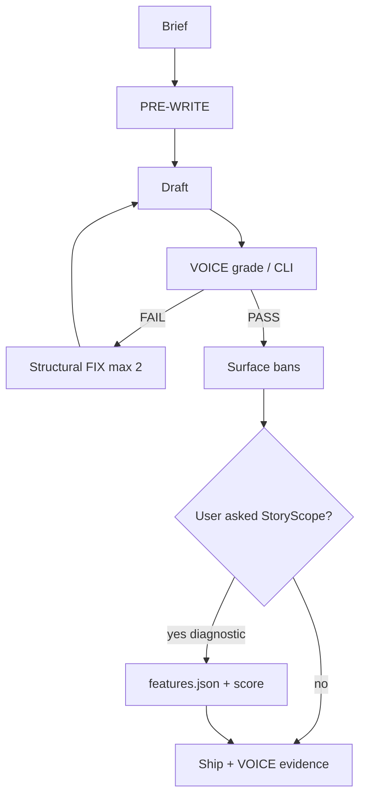
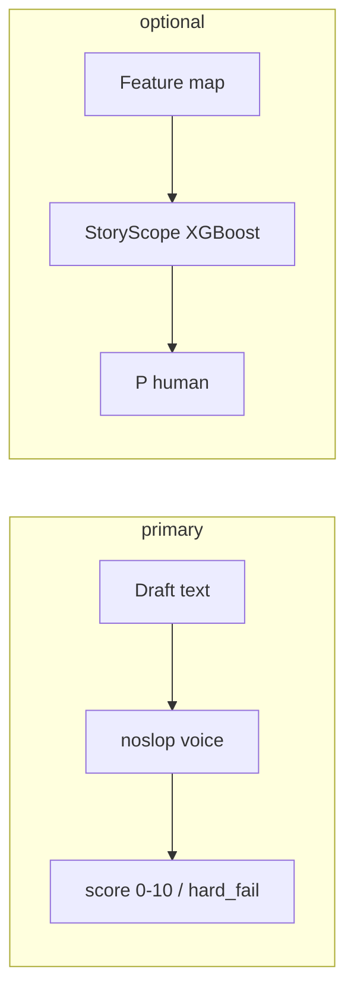

# noslop

<p align="center">
  
</p>

<p align="center">
  Agent skill for prose that doesn’t read like template AI — plus optional offline scorers.
</p>

**Ship gate = VOICE** (reader anti-slop). StoryScope P(human) is diagnostic only. Not GPTZero-proof.

---

## What this is

| Piece | Path | Job |
|-------|------|-----|
| **Skill** | `skills/noslop/` | PRE-WRITE → draft → **VOICE** → FIX |
| **VOICE CLI** | `python -m noslop.cli voice` | Heuristic anti-slop score (primary) |
| **StoryScope CLI** | `python -m noslop.cli score` | Feature-map XGBoost (optional) |
| **Evals** | `evals/` | A/B + human book baseline + charts |

**Triggers:** `noslop`, write human, anti AI voice, `/noslop`  
**Not for:** code cleanup, pure data dumps

---

## What this is not

| Claim | Reality |
|-------|---------|
| Fools GPTZero | **No guarantee.** Samples can still flag as AI. |
| StoryScope ≥ 0.5 = literary | **False.** Books mean ~**0.13** P(human) on that scorer. |
| Ban-list only | Structure + mess first; bans second. |

Three rulers: **reader voice**, **StoryScope features**, **commercial detectors**. Don’t mix them up.

---

## Architecture





---

## Install

```powershell
Copy-Item -Force .\skills\noslop\* $env:USERPROFILE\.claude\skills\noslop\
```

Scorer runtime:

```powershell
cd C:\path\to\noslop
python -m venv .venv
.\.venv\Scripts\pip install -r requirements.txt
$env:PYTHONPATH="src"
```

---

## Quickstart

### Skill

```
/noslop
Write a short cold email about X.
```

Agent should fill PRE-WRITE, draft, VOICE — not a raw first blob.

### VOICE CLI (primary)

```powershell
$env:PYTHONPATH="src"
.\.venv\Scripts\python.exe -m noslop.cli voice --text-file draft.md --json
```

PASS: **score ≥ 6.5** and `hard_fail: false`.

### StoryScope (optional)

```powershell
.\.venv\Scripts\python.exe -m noslop.cli score --features features.json --json
```

Never sole ship gate. Lean feature packs + span cites if you use it.

---

## Eval results (VOICE)

From [`evals/results/SUMMARY_V2.md`](evals/results/SUMMARY_V2.md):

| Brief | default | noslop | Δ |
|-------|---------|--------|---|
| mall_shoe | 0.88 | **9.12** | +8.2 |
| cold_email | 4.91 | **9.12** | +4.2 |
| personal_bio | 3.16 | **9.12** | +6.0 |
| saas_blurb | 3.16 | **8.25** | +5.1 |
| agent_answer | 5.26 | **8.25** | +3.0 |

**5/5** meet noslop ≥ 6.5 and Δ ≥ 1.5.

Full drafts: [`evals/results/v2/`](evals/results/v2/) · flagship [`sample_flagship.md`](evals/results/v2/sample_flagship.md)

```powershell
.\.venv\Scripts\python.exe evals\run_voice_ab.py
.\.venv\Scripts\python.exe evals\plot_compare.py
```

### Excerpts (quoted text)

Same brief, two arms. Scores from VOICE CLI.

#### mall shoe · default · 0.88

> The mall went quiet. A security guard found a child's shoe and had to decide what to do. It's important to note that these situations can be complex. He leveraged training protocols to unlock the best outcome. At the end of the day, what matters is caring first. I used to think the job was about rules. Turns out it was about heart.

#### mall shoe · noslop · 9.12

> 1:14 a.m. Food court. Pretzel neon still on. Blue toddler sneaker under C7 — Velcro half up, grit in the tread.
>
> Radio: no kid tickets. I bagged it. Tag: M. HALE. Shelf next to a charger nobody claims.
>
> Didn't call. Walked the dock anyway. Cart with one frozen wheel. Nothing.
>
> Thursday Anita waves me over. Green coat. Boy, one sock. They left Tuesday mid-fight. Daycare called about the missing shoe.
>
> I hand over the bag. Pen click. Log line clean.
>
> Still check C7 out of habit. The shelf has a gap. I leave it.

#### cold email · default · 4.91

> Hi,
>
> I hope this email finds you well. In today's rapidly evolving healthcare landscape, we leverage cutting-edge analytics to unlock actionable insights and empower clinics to streamline no-show rates. Our robust, seamless dashboard will revolutionize your operations.
>
> I'd love to schedule a brief call to discuss how we can foster better outcomes together.
>
> Best regards,  
> Alex

#### cold email · noslop · 9.12

> Subject: Thursday 9–11 no-shows (14 slots / 6 empty)
>
> Maya —
>
> Friend at a two-site clinic sent a stripped booking export. Thursday 9:00–11:30: fourteen slots, six empty. Their monthly average still shows 18%. The hole vanishes into the average.
>
> I fix that kind of lie. Jakarta timezone. Shared sheet, three days, not a platform pitch.
>
> Reply with any ugly Tuesday CSV. Marked version back by Friday 5 p.m. WIB. WhatsApp ok: +62 812-0000-4411.
>
> If noise, delete.
>
> — Raka

### Charts


Gallery: [`evals/results/figures/README.md`](evals/results/figures/README.md)

### StoryScope + books (diagnostic)

| Cohort | mean P(human) |
|--------|----------------|
| Book excerpts | **~0.13** |
| default AI | ~0.02 |
| noslop (StoryScope packs) | ~0.58 |

Details: [`evals/results/HUMAN_BASELINE.md`](evals/results/HUMAN_BASELINE.md). High StoryScope can be **feature gaming**.

---

## Skill pack

| File | Role |
|------|------|
| `SKILL.md` | Loop, VOICE ship rule |
| `voice.md` | Axes + anti-templates |
| `checklists.md` | PRE-WRITE / VOICE templates |
| `style-and-bans.md` | Surface after VOICE |
| `human_coding.md` | StoryScope constructions (optional) |
| `core_features.md` | Feature IDs (optional) |

---

## Repo layout

```
noslop/
  assets/logo.jpg
  skills/noslop/
  src/noslop/          # voice, score, template, …
  artifacts/           # taxonomy + XGBoost weights
  evals/results/v2/    # draft text A/B
  evals/results/figures/  # matplotlib charts only
  docs/superpowers/
  tests/
```

---

## License

MIT. StoryScope notices: [`THIRD_PARTY_NOTICES.md`](THIRD_PARTY_NOTICES.md).  
Paper: [arXiv:2604.03136](https://arxiv.org/abs/2604.03136).
