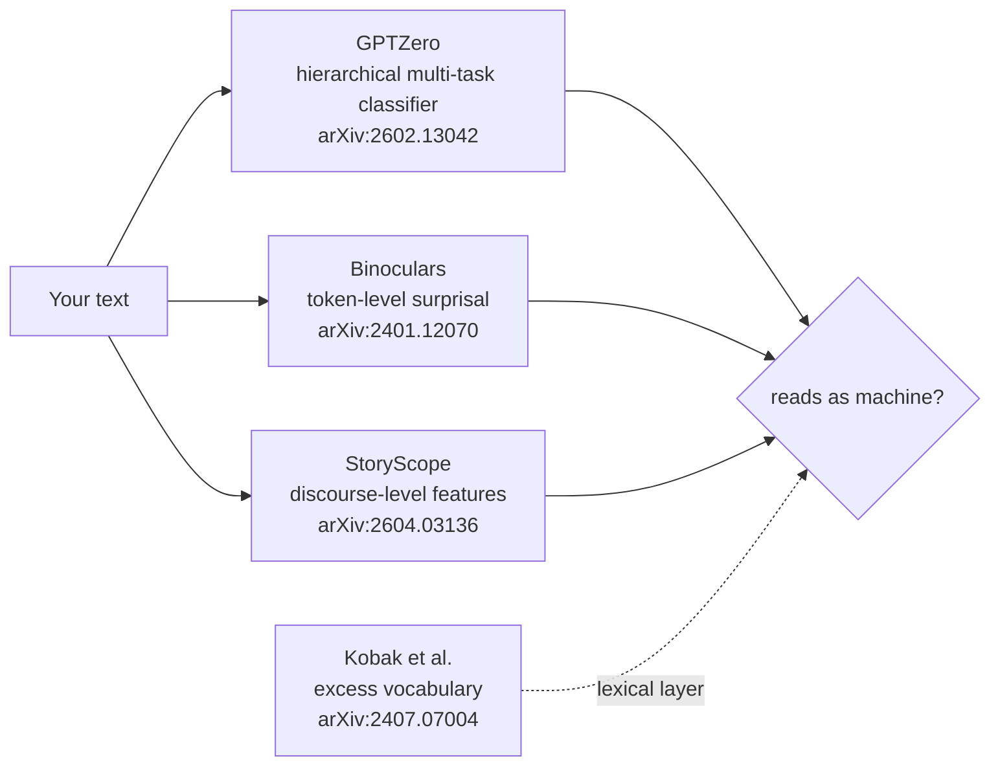
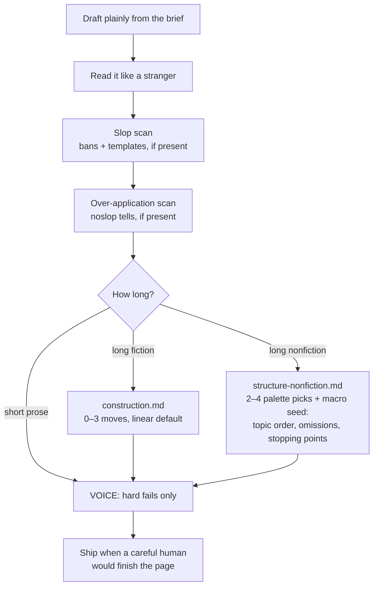

# noslop

<p align="center">
  
</p>

<p align="center"><b>An agent skill for prose that doesn’t read like template AI.</b><br/>
Write so a careful human finishes the page.</p>

---

## What it is

noslop is a skill pack your agent loads before it writes. It works like a
**linter, not a style**: draft plainly from the brief, then scan for two kinds
of tells and cut only what you find —

1. **Slop tells** — glue words, template phrases, sermon closes, dash spam
   ([style-and-bans.md](skills/noslop/style-and-bans.md)).
2. **Over-application tells** — anchor stuffing, fragment cosplay, signature
   closers, punchy one-line morals. The skill's own failure mode.

That second scan is the point. Anti-slop rules applied too hard produce a new
kind of slop: every draft comes out with the same number-stuffed, telegraphic,
"if this is noise, delete it" skeleton. A rule pack that makes every draft
identical just moves the cluster detectors catch. Human writing is diverse,
so noslop's ship bar stays human: a careful reader finishes the page.

## What it is not: the evenness problem

Clean vocabulary is the floor, not the fix. A draft can pass every ban and
still read as machine, because the deeper tell is **evenness** — one register
held end to end, every section built the same way, every thought closed,
every sentence resolving at the same rate. Research on AI text keeps landing
on the same conclusion: style cues are weak evidence, but *construction* —
how a piece is built — separates machine drafts from human ones (see
[Reference papers](#reference-papers)).

So noslop has two structural layers, both built as menus rather than rules:

| Layer | File | For |
|-------|------|-----|
| Story construction | [`skills/noslop/construction.md`](skills/noslop/construction.md) | Long fiction (~1k+ words) |
| Nonfiction structure | [`skills/noslop/structure-nonfiction.md`](skills/noslop/structure-nonfiction.md) | Long essays, reports (~1k+ words) |

Each layer says the same thing in its genre's terms: pick a few moves, skip
the rest on purpose, and never let two drafts share a skeleton.

| You get | Where |
|---------|--------|
| Skill for Claude Code / similar | [`skills/noslop/`](skills/noslop/) |
| VOICE hard-fail check (flags, not a grade) | `python -m noslop.cli voice` |
| Optional StoryScope feature score (lab) | `python -m noslop.cli score` |
| Side-by-side drafts + charts | [`evals/`](evals/) |

**Trigger:** `noslop` · “write human” · “anti AI voice” · `/noslop`
**Skip for:** code cleanup, pure data dumps

---

## The two machines

What detectors measure, per the papers — three different mechanisms that all
punish the same thing: predictability.



What noslop does about it — move before generation, not after:



noslop is a craft tool, not a detector tool. It promises a readable page,
not a number; detector checks, when you run them, are smoke tests with a
strict iteration budget ([detector clause](skills/noslop/structure-nonfiction.md#detector-clause)).

---

## See the difference

Same brief. **default** = raw model. **noslop** = skill applied.
Note the noslop drafts don't share a skeleton — that's deliberate. If your
noslop outputs all look alike, you're over-applying it.

### Cold email — default

```text
Hi Jordan,

I hope this email finds you well. In today's competitive logistics landscape,
we leverage cutting-edge route optimization to unlock actionable savings and
empower fleets to streamline last-mile delivery. Our robust, seamless platform
will revolutionize your operations.

I'd love to schedule a brief call to discuss how we can foster better outcomes
together.

Best regards,
Sam
```

### Cold email — noslop

```text
Subject: Thursday mornings at the clinic

Hi Maya,

A friend who runs a two-site clinic showed me their booking export last week.
The monthly no-show rate looked fine, about 18%. Thursday mornings didn't.
Half the early slots sat empty, and the average hid it.

I help clinics see where the average is lying. Usually that means a shared
sheet and a few days of looking, not new software.

If you want, send any recent booking export with names stripped and I'll
mark the gaps. Either way, hope the Thursdays improve.

Raka
```

### Personal bio — default

```text
I am a passionate product designer with a proven track record of delivering
robust, user-centric experiences. I thrive in collaborative environments and
am dedicated to continuous learning. In my free time I enjoy hiking and
exploring new technologies.
```

### Personal bio — noslop

```text
I'm a product designer in Portland, currently on checkout for a regional
grocer. Last thing I shipped: cut the gift-card flow from seven screens to
three after watching people abandon carts in session recordings. Before that,
two years on dispute flows at a payments company, which is where I stopped
believing error messages are copy anyone reads.

Outside work I play rec soccer on Wednesdays. Bad left ankle. The team chat
is chaos and I wouldn't have it otherwise.
```

### SaaS blurb — default

```text
Our cutting-edge inventory platform seamlessly transforms messy stock data
into comprehensive, actionable insights. Leverage AI to unlock growth,
streamline workflows, and empower your team with robust, scalable clarity.
```

### SaaS blurb — noslop

```text
Stock exports are messy. The qty column is sometimes units, sometimes cases.
Excel strips the leading zeros off SKUs. The same shelf shows up as MAIN,
Main, and WH-1.

Upload the file and we flag the mismatches before you trust a reorder. You
get one plain sheet: what to buy, what to ignore, what to ask the warehouse
about. No chatbot, no insights feed.
```

### Agent answer — default

```text
Redis connection errors in production are a common challenge. It's important
to note that timeouts often cause intermittent failures. To comprehensively
address this, you should leverage robust retry strategies and ensure proper
configuration. Furthermore, implementing best practices around connection
pooling can elevate reliability. In conclusion, take a holistic approach.
```

### Agent answer — noslop

```text
If the error is `READONLY You can't write against a read only replica`, your
app is writing to a replica (or the primary failed over and the client still
holds the old role).

Check `INFO replication` on the host the app points at and look for
`role:master`. If it says slave, point writes at the primary, or use a client
library that follows redirects.

Retrying harder won't help here. The writes are landing on a node that can't
accept them.
```

Older eval drafts live in [`evals/results/`](evals/results/) — the `modes/` and
`v2/` folders predate the linter reframe and show the over-application problem
(same skeleton on every arm) that this version fixes.

---

## How it works

1. **Draft** from the brief. No checklist in hand.
2. **Read it like a stranger.** Would a careful human finish it? Yes → ship.
3. **Slop scan** — cut hard bans, templates, sermon closes *if present*.
4. **Over-application scan** — cut anchor stuffing, fragment cosplay,
   signature closers *if present*.
5. **Long prose only** — if it sags structurally:
   fiction → [construction.md](skills/noslop/construction.md) (0–3 moves,
   linear default); nonfiction →
   [structure-nonfiction.md](skills/noslop/structure-nonfiction.md)
   (2–4 palette picks, macro seed, named skips). Short prose never gets
   structural toys.
6. **VOICE** — hard-fail flags only (sermon / ban spam / zero anchors).
7. **Ship** when a careful human would finish the page.

Full skill: [`skills/noslop/SKILL.md`](skills/noslop/SKILL.md)

## Modes

Modes = how much the skill interferes. Default: **balanced**.

| Mode | Use |
|------|-----|
| **modest** | Slop scan only — letters, notes, anything that should feel unforced |
| **balanced** | Fix what the scans catch, add nothing — default |
| **max** | Research only — expect stiffness |

## VOICE and StoryScope

| Tool | Role |
|------|------|
| **VOICE** (`noslop.cli voice`) | Hard-fail flags (sermon, ban spam, fog) + fragment-stack detector. Exit code = flags only; the number is lab diagnostics — never iterate to raise it |
| **StoryScope** (`noslop.cli score`) | Optional lab feature score vs the research binary. Honest labels only, never a ship gate |

---

## Reference papers

The skill's design rests on these. One line each; the rules themselves stay
general on purpose.

| Paper | What it shows | What noslop takes from it |
|-------|---------------|---------------------------|
| **StoryScope** — Russell et al., [arXiv:2604.03136](https://arxiv.org/abs/2604.03136) | Discourse-level features alone separate AI fiction from human at 93% F1 with style removed: AI over-explains themes, closes every thread, and clusters in one region of narrative space | Structure outranks style. Both construction layers exist because of this paper; the diversity seed exists because of the clustering finding |
| **GPTZero** — Adam et al., [arXiv:2602.13042](https://arxiv.org/abs/2602.13042) | Industrial detection is a hierarchical multi-task classifier, red-teamed against paraphrasing and adversarial edits | Post-hoc word swaps don't move modern detectors. The only honest lever is how the draft is built |
| **Binoculars** — Hans et al., [arXiv:2401.12070](https://arxiv.org/abs/2401.12070) | Token-level predictability separates machine text at >90% recall with near-zero false positives | Human writing is genuinely unpredictable at the *choice* level — hence the macro seed: topic order, real omissions, early stopping points |
| **Detector disagreement** — Alshammari & Rao, [arXiv:2507.17944](https://arxiv.org/abs/2507.17944) | Automated "humanizer" attacks only half-work, and detectors disagree wildly across vendors | One smoke test, one detector, one structural re-pass at most. No paraphrase tools, no score farming |
| **Excess vocabulary** — Kobak et al., [arXiv:2407.07004](https://arxiv.org/abs/2407.07004) | AI text carries a lexical fingerprint (the "delve" class of words) | The ban list in [style-and-bans.md](skills/noslop/style-and-bans.md) — the surface layer, owned there |

---

## Install

### Skill (Claude Code / similar)

Via the [skills CLI](https://skills.sh) (repo is public):

```bash
npx skills add vstalingrady/noslop
```

Or manually:

```powershell
Copy-Item -Force .\skills\noslop\* $env:USERPROFILE\.claude\skills\noslop\
```

```
/noslop
Write a short cold email about clinic no-shows.
```

### CLI (optional)

```powershell
cd C:\path\to\noslop
python -m venv .venv
.\.venv\Scripts\pip install -r requirements.txt
$env:PYTHONPATH="src"

.\.venv\Scripts\python.exe -m noslop.cli voice --text-file draft.md --json
.\.venv\Scripts\python.exe -m noslop.cli score --features features.json --json
```

---

## Layout

```
noslop/
  assets/logo.jpg
  skills/noslop/           # agent skill (install this)
    construction.md        # long-fiction structure layer
    structure-nonfiction.md # long-nonfiction structure layer
  src/noslop/              # voice + optional StoryScope CLI
  artifacts/               # taxonomy + model weights
  evals/results/           # A/B drafts (older arms show the old regime)
  tests/
```

---

## License

MIT. StoryScope and surface-list notices: [`THIRD_PARTY_NOTICES.md`](THIRD_PARTY_NOTICES.md).
Paper: [arXiv:2604.03136](https://arxiv.org/abs/2604.03136).
