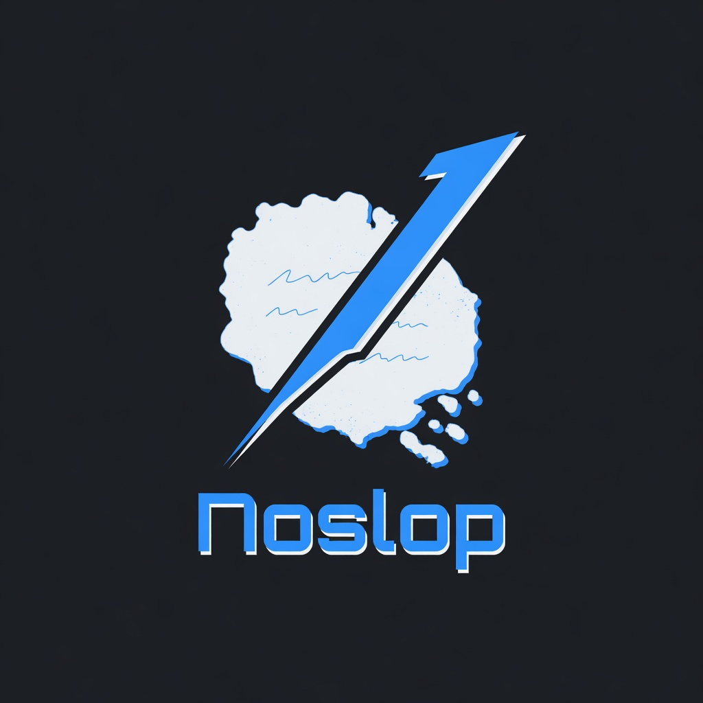
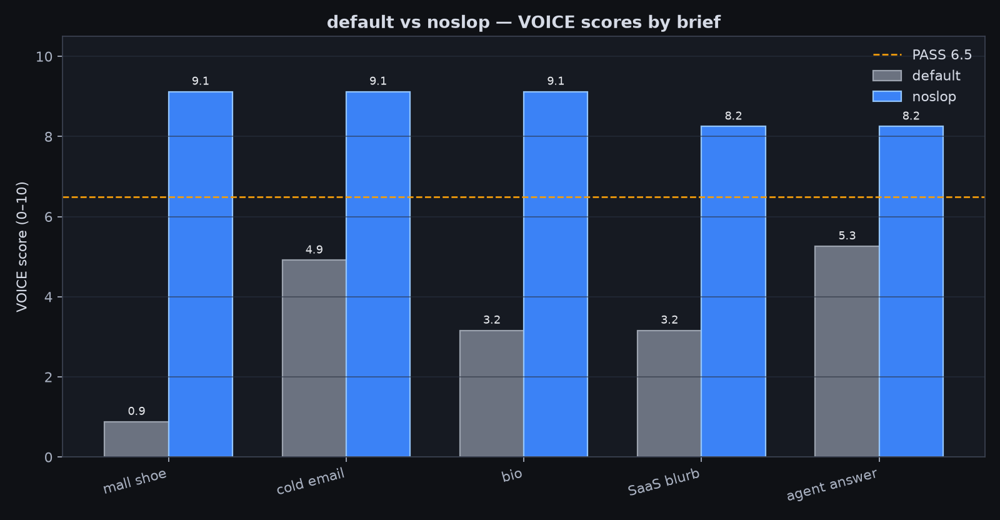
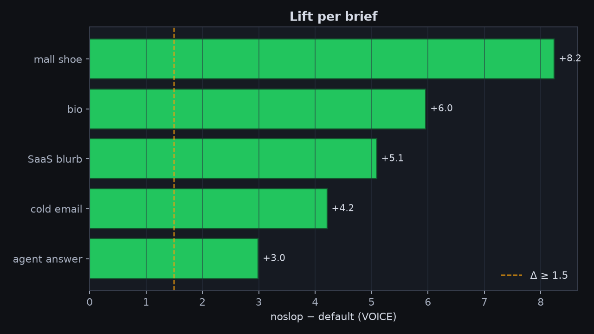
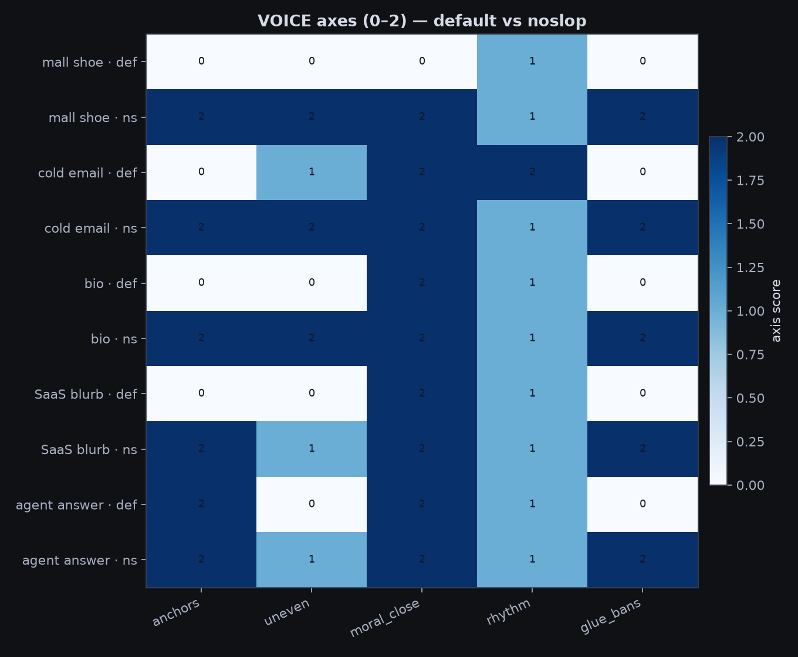
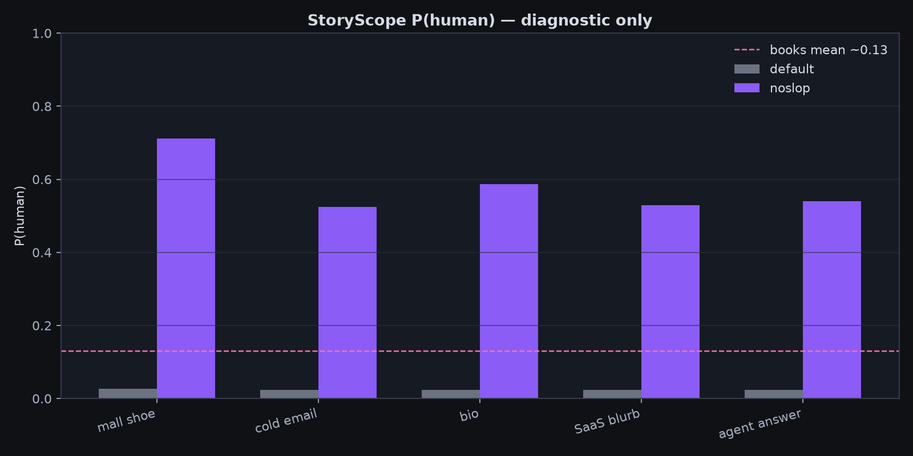
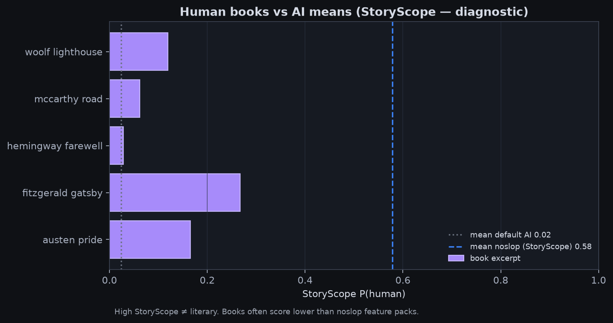
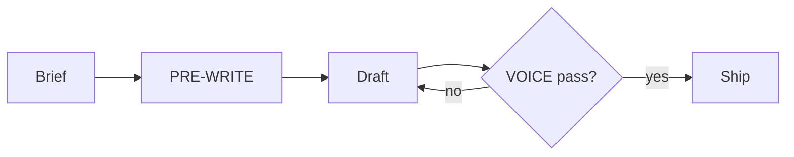

# noslop

<p align="center">
  
</p>

<p align="center"><b>An agent skill for writing that doesn’t sound like a template LLM.</b><br/>
Optional local tools to score drafts.</p>

---

## In one minute

**Problem:** Model prose often fills itself with glue (“leverage”, “unlock”, “at the end of the day”), abstract fog, and a tidy moral at the end.

**What noslop does:** Gives the agent a **checklist before it drafts** — anchors (times, names, places), room for mess, no sermon close — then a **VOICE score** so it can fail and fix instead of shipping slop.

| You get | Where |
|---------|--------|
| Skill files for Claude / similar agents | `skills/noslop/` |
| Score a draft for slop patterns | `python -m noslop.cli voice` |
| Optional discourse scorer (StoryScope-style) | `python -m noslop.cli score` |
| Side-by-side eval drafts + charts | `evals/` |

**Say:** `noslop` · “write human” · “anti AI voice” · `/noslop`  
**Skip for:** code cleanup, pure data dumps

---

## See the difference

Same prompt. **default** = typical model goo. **noslop** = skill applied.  
Scores are the local VOICE tool (0–10; pass is ≥ 6.5).

### Cold email — default · 4.91

```text
Hi,

I hope this email finds you well. In today's rapidly evolving healthcare
landscape, we leverage cutting-edge analytics to unlock actionable insights
and empower clinics to streamline no-show rates. Our robust, seamless
dashboard will revolutionize your operations.

I'd love to schedule a brief call to discuss how we can foster better
outcomes together.

Best regards,
Alex
```

### Cold email — noslop · 9.12

```text
Subject: Thursday 9–11 no-shows (14 slots / 6 empty)

Maya —

Friend at a two-site clinic sent a stripped booking export. Thursday
9:00–11:30: fourteen slots, six empty. Their monthly average still shows
18%. The hole vanishes into the average.

I fix that kind of lie. Jakarta timezone. Shared sheet, three days, not a
platform pitch.

Reply with any ugly Tuesday CSV. Marked version back by Friday 5 p.m. WIB.
WhatsApp ok: +62 812-0000-4411.

If noise, delete.

— Raka
```

### Mall shoe (short fiction) — default · 0.88

```text
The mall went quiet. A security guard found a child's shoe and had to decide
what to do. It's important to note that these situations can be complex. He
leveraged training protocols to unlock the best outcome. At the end of the
day, what matters is caring first. I used to think the job was about rules.
Turns out it was about heart.
```

### Mall shoe — noslop · 9.12

```text
1:14 a.m. Food court. Pretzel neon still on. Blue toddler sneaker under C7 —
Velcro half up, grit in the tread.

Radio: no kid tickets. I bagged it. Tag: M. HALE. Shelf next to a charger
nobody claims.

Didn't call. Walked the dock anyway. Cart with one frozen wheel. Nothing.

Thursday Anita waves me over. Green coat. Boy, one sock. They left Tuesday
mid-fight. Daycare called about the missing shoe.

I hand over the bag. Pen click. Log line clean.

Still check C7 out of habit. The shelf has a gap. I leave it.
```

More drafts: [`evals/results/v2/`](evals/results/v2/)

---

## Numbers (same five briefs)

| Brief | default | noslop | gain |
|-------|---------|--------|------|
| mall shoe | 0.88 | **9.12** | +8.2 |
| cold email | 4.91 | **9.12** | +4.2 |
| bio | 3.16 | **9.12** | +6.0 |
| SaaS blurb | 3.16 | **8.25** | +5.1 |
| agent answer | 5.26 | **8.25** | +3.0 |

All five: noslop ≥ 6.5 and at least +1.5 over default.  
Source: [`evals/results/SUMMARY_V2.md`](evals/results/SUMMARY_V2.md)

```powershell
$env:PYTHONPATH="src"
.\.venv\Scripts\python.exe evals\run_voice_ab.py
.\.venv\Scripts\python.exe evals\plot_compare.py
```

### Charts

Scores only (no draft text in images):







Optional StoryScope scorer (different metric — see below):





---

## How the skill works

```text
brief → PRE-WRITE checklist → draft → VOICE check → fix if needed → ship
         (optional: StoryScope feature score for research only)
```



1. **PRE-WRITE** — who it’s for, anchors, one mess, one boring detail, what *not* to force  
2. **Draft** — those lines have to show up in the text  
3. **VOICE** — score anchors, unevenness, no sermon close, rhythm, ban words  
4. **Bans** — surface cleanup after structure (`style-and-bans.md`)  
5. **StoryScope** — only if you care about that paper’s feature model; **not** required to ship  

Skill files: [`skills/noslop/`](skills/noslop/) — `SKILL.md`, `voice.md`, `checklists.md`, …

---

## Two scorers (don’t mix them up)

| Tool | What it answers | Ship? |
|------|-----------------|-------|
| **VOICE** | Does this draft look like template slop? | **Yes — primary** |
| **StoryScope** | Does a feature map look “human-class” to a research model? | Optional only |

On StoryScope, classic book excerpts average about **0.13** P(human), while gamed feature packs can hit **0.5+**. So a high StoryScope number is **not** “sounds like a novel.” Details: [`evals/results/HUMAN_BASELINE.md`](evals/results/HUMAN_BASELINE.md).

---

## Repo layout

```
noslop/
  assets/logo.jpg
  skills/noslop/           # install this into your agent
  src/noslop/              # voice + optional StoryScope CLI
  artifacts/               # taxonomy + model weights
  evals/results/v2/        # draft pairs (plain text)
  evals/results/figures/   # charts
  tests/
```

---

## Install

### 1. Skill (Claude Code / similar)

```powershell
Copy-Item -Force .\skills\noslop\* $env:USERPROFILE\.claude\skills\noslop\
```

Then in chat:

```
/noslop
Write a short cold email about X.
```

### 2. Local CLI (optional)

```powershell
cd C:\path\to\noslop
python -m venv .venv
.\.venv\Scripts\pip install -r requirements.txt
$env:PYTHONPATH="src"

.\.venv\Scripts\python.exe -m noslop.cli voice --text-file draft.md --json
# research only:
.\.venv\Scripts\python.exe -m noslop.cli score --features features.json --json
```

VOICE pass: score **≥ 6.5** and `hard_fail: false`.

---

## License

MIT. StoryScope notices: [`THIRD_PARTY_NOTICES.md`](THIRD_PARTY_NOTICES.md).  
Paper: [arXiv:2604.03136](https://arxiv.org/abs/2604.03136).
