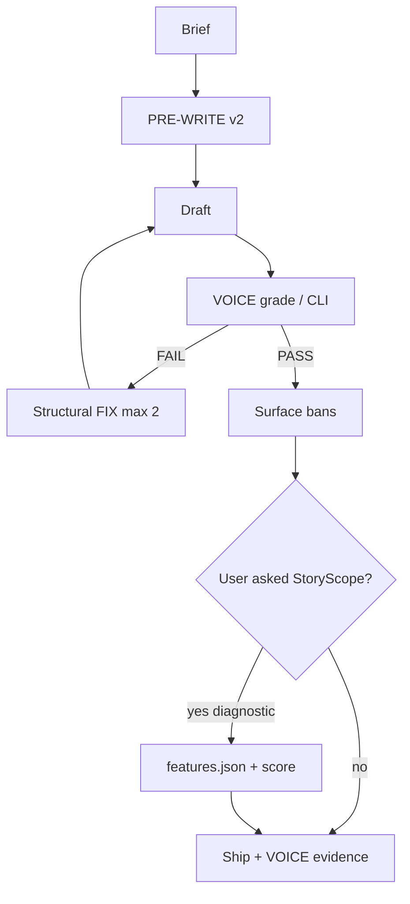
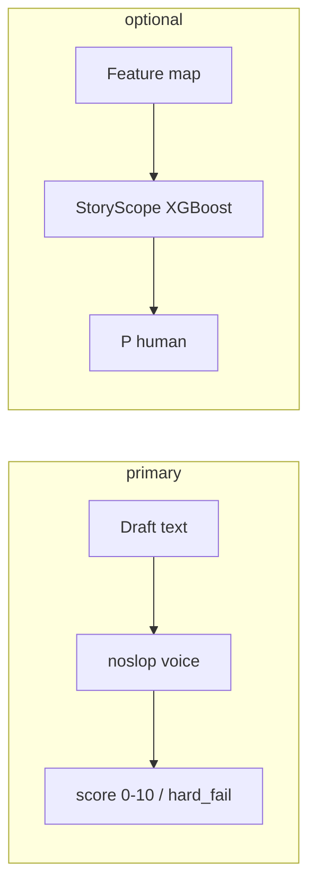
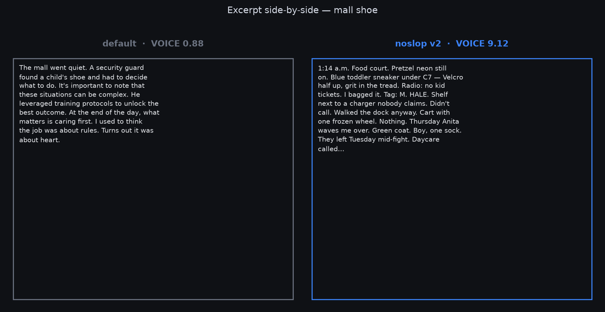

# noslop

Agent skill for prose that doesn’t read like template AI — plus optional offline scorers.

**v2 ship gate = VOICE** (reader anti-slop). StoryScope P(human) is diagnostic only. Not GPTZero-proof.

---

## What this is

| Piece | Path | Job |
|-------|------|-----|
| **Skill** | `skills/noslop/` | PRE-WRITE → draft → **VOICE** → FIX |
| **VOICE CLI** | `python -m noslop.cli voice` | Heuristic anti-slop score (primary) |
| **StoryScope CLI** | `python -m noslop.cli score` | Feature-map XGBoost (optional) |
| **Evals** | `evals/` | A/B + human book baseline |

**Triggers:** `noslop`, write human, anti AI voice, `/noslop`  
**Not for:** code cleanup, pure data dumps

---

## What this is not

| Claim | Reality |
|-------|---------|
| Fools GPTZero | **No guarantee.** v1 sample was still “highly confident AI.” |
| StoryScope ≥ 0.5 = literary | **False.** Books mean ~**0.13** P(human) on that scorer. |
| Ban-list only | Structure + mess first; bans second. |

Three different rulers: **reader voice**, **StoryScope features**, **commercial detectors**. Don’t mix them up.

---

## Architecture





---

## Install

```powershell
Copy-Item -Force .\skills\noslop\* $env:USERPROFILE\.claude\skills\noslop\
```

Scorer runtime:

```powershell
cd C:\path\to\noslop
python -m venv .venv
.\.venv\Scripts\pip install -r requirements.txt
$env:PYTHONPATH="src"
```

---

## Quickstart

### Skill

```
/noslop
Write a short cold email about X.
```

Agent should fill PRE-WRITE v2, draft, VOICE — not a raw first blob.

### VOICE CLI (primary)

```powershell
$env:PYTHONPATH="src"
.\.venv\Scripts\python.exe -m noslop.cli voice --text-file draft.md --json
```

PASS: **score ≥ 6.5** and `hard_fail: false`.

### StoryScope (optional)

```powershell
.\.venv\Scripts\python.exe -m noslop.cli score --features features.json --json
```

Never sole ship gate. Lean feature packs + span cites if you use it.

---

## Eval results (v2 VOICE)

From [`evals/results/SUMMARY_V2.md`](evals/results/SUMMARY_V2.md):

| Brief | default | noslop-v2 | Δ |
|-------|---------|-----------|---|
| mall_shoe | 0.88 | **9.12** | +8.2 |
| cold_email | 4.91 | **9.12** | +4.2 |
| personal_bio | 3.16 | **9.12** | +6.0 |
| saas_blurb | 3.16 | **8.25** | +5.1 |
| agent_answer | 5.26 | **8.25** | +3.0 |

**5/5** meet noslop ≥ 6.5 and Δ ≥ 1.5.

Flagship: [`evals/results/v2/sample_flagship.md`](evals/results/v2/sample_flagship.md)

```powershell
.\.venv\Scripts\python.exe evals\run_voice_ab.py
.\.venv\Scripts\python.exe evals\plot_compare.py
```

### Charts





Full gallery: [`evals/results/figures/README.md`](evals/results/figures/README.md)

### StoryScope + books (diagnostic)

| Cohort | mean P(human) |
|--------|----------------|
| Book excerpts | **~0.13** |
| default AI | ~0.02 |
| noslop (v1 StoryScope packs) | ~0.58 |

Details: [`evals/results/HUMAN_BASELINE.md`](evals/results/HUMAN_BASELINE.md). High StoryScope can be **feature gaming**. The pink line on the books chart is that ~0.13 mean.

---

## Skill pack

| File | Role |
|------|------|
| `SKILL.md` | v2 loop, VOICE ship rule |
| `voice.md` | Axes + anti-templates |
| `checklists.md` | PRE-WRITE / VOICE templates |
| `style-and-bans.md` | Surface after VOICE |
| `human_coding.md` | StoryScope constructions (optional) |
| `core_features.md` | Feature IDs (optional) |

---

## Repo layout

```
noslop/
  skills/noslop/
  src/noslop/          # voice, score, template, …
  artifacts/           # taxonomy + XGBoost weights (not retrained by skill)
  evals/results/v2/    # VOICE A/B drafts
  docs/superpowers/    # design + plans
  tests/
```

---

## License

MIT. StoryScope notices: [`THIRD_PARTY_NOTICES.md`](THIRD_PARTY_NOTICES.md).  
Paper: [arXiv:2604.03136](https://arxiv.org/abs/2604.03136).
